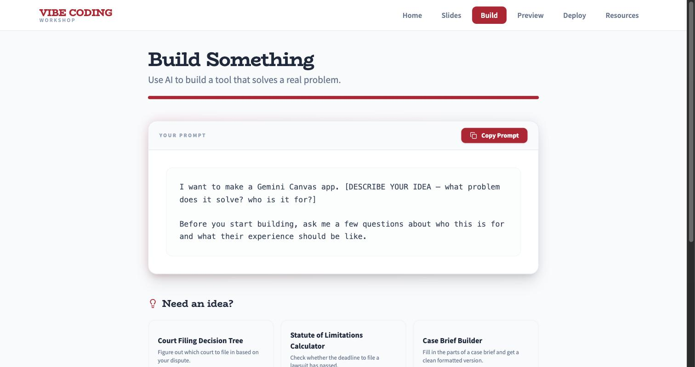

# Vibe Coding Workshop

**[▶ Open the live site](https://rlfordon.github.io/vibe-coding-workshop/)**

A workshop kit for teaching **vibe coding** — building working web apps by describing what you want to an AI, with no prior programming experience. It's a single static site that runs an entire session: slides, a prompt launchpad, a live code previewer, a deployment guide, and curated resources.

Built for legal audiences (law students, faculty, and practitioners), but nothing about the machinery is law-specific — swap the prompts and slides and it works for any discipline.



---

## One site, several events

The same deployment serves multiple audiences. Each event config defines its own tabs, slide deck, project ideas, and resources, selected by URL hash:

| Event | URL | Audience |
|---|---|---|
| Workshop | [`/`](https://rlfordon.github.io/vibe-coding-workshop/) | Students — hands-on build session |
| Faculty | [`/#faculty`](https://rlfordon.github.io/vibe-coding-workshop/#faculty) | Law professors — what AI-assisted development means for teaching |
| Practice Summit | [`/#practicesummit`](https://rlfordon.github.io/vibe-coding-workshop/#practicesummit) | Practitioners — building tools for legal practice |
| CALIcon 26 | [`/#calicon26`](https://rlfordon.github.io/vibe-coding-workshop/#calicon26) | Conference session for law faculty |

Anything unrecognized falls back to the student workshop. There's also [`/#portfolio`](https://rlfordon.github.io/vibe-coding-workshop/#portfolio), a standalone showcase of tools built this way.

## What's in a session

- **Slides** — a self-contained HTML deck with auto-scaling and arrow-key navigation. Add `?present=1` to keep the deck mounted across tab switches so it holds its position while you demo something else.
- **Build** — a prompt launchpad. One copyable template plus idea cards; clicking a card swaps in a full, ready-to-paste prompt. Lowers the barrier from "stare at a blank box" to "pick a thing and go."
- **Preview** — paste code straight from Gemini Canvas and see it render. Handles plain HTML *and* React/JSX with imports, resolving libraries from CDN automatically.
- **Showcase** — finished tools with category filters and an image lightbox, configured per event.
- **Deploy** — a step-by-step guide for students publishing their own projects.
- **Resources** — curated links for people who want to keep going afterward.

---

## Fork it for your own workshop

The site is fully static, so a fork costs nothing to host. Everything you'd want to change lives in a handful of files:

| What | Where | Notes |
|------|-------|-------|
| **Events, tabs, ideas, resources** | `client/src/eventConfigs.js` | The main file you'll edit. Each config sets its own tabs, slide deck, Home steps, prompt idea cards, showcase items, and links. Copy an existing config and rename the `id` to add an event. |
| **Slide content** | `client/public/slides*.html` | Self-contained HTML — edit directly, no build step. One deck per event. |
| **Base path** | `client/vite.config.js` | Set `base` to `'/<your-repo-name>/'` for GitHub Pages, or `'/'` for a custom domain. |
| **Branding & colors** | `client/src/App.jsx` | Primary color and fonts are set inline. |
| **Deploy guide** | `client/src/Deploy.jsx` | The instructions students follow to publish their work. |
| **Backup handout** | `backup-handout.html` | Offline HTML with all prompts and the session plan — worth having when conference wifi fails. |

### What you get out of the box

- A **sandboxed iframe renderer** that takes AI-generated code — plain HTML or React/JSX with imports — and renders it live, with no per-student setup
- A **prompt launchpad** that hands people a well-crafted starting prompt instead of a blank text box
- **Multiple event configs** in one deployment, so a student workshop, a faculty talk, and a conference session share a URL and differ by hash
- **Zero-cost hosting** — no server, no database, no cold starts

---

## Deploying

`.github/workflows/deploy.yml` lints, builds, and publishes to GitHub Pages on every push to `master`.

1. Fork the repo
2. Set `base` in `client/vite.config.js` to `'/<your-repo-name>/'`
3. In your fork: **Settings → Pages → Build and deployment → Source → GitHub Actions**
4. Push to `master`

The site lands at `https://<your-username>.github.io/<your-repo-name>/`.

> **Base-path gotcha.** GitHub Pages serves from a subpath, and Vite rewrites imports and `index.html` but never runtime string literals. Root-relative paths in JS (`/slides.html`, `/showcase/foo.png`) would 404 without help, and the build succeeds either way — so this fails silently. `client/src/assetUrl.js` rebases them at the point of use; route any new root-relative asset path through it. On a custom domain with `base: '/'`, it becomes a no-op.

**Free Pages hosting requires a public repo.** If you need yours private, a Render Static Site or Cloudflare Pages will host it free instead — change `base` to `'/'` and point the host at `client/` with a `npm run build` / `dist` config.

---

## How it works

**Fully static.** React 19 + Vite + Tailwind v4, compiled to files a CDN can serve. There is no backend, no database, and no API. Earlier versions ran an Express + SQLite server for a project gallery where students submitted and voted on work; that was removed in favor of the static Showcase, which is why hosting is now free.

**Routing** is hash-based (`/#faculty`), which is what lets an SPA live on Pages without 404 rewrite rules. `?present=1` is the only query parameter.

**The iframe renderer** (`SandboxedIframe.jsx`) is the interesting part. Students paste whatever the AI gave them, which may be a React component with `import` statements — not something a browser runs directly. `prepareHtml()` parses the imports, strips them, maps each to a CDN `<script>` plus a `const { … } = window.Global` shim, and wraps the result in an HTML shell with React, Babel standalone, and Tailwind. It renders in a sandboxed iframe via a Blob URL.

### Running locally

```bash
cd client && npm install
npm run dev
```

Opens at **http://localhost:5173**. There's no server to start.

To check a production build the way it will actually be served:

```bash
cd client && npm run build && npm run preview
```

### Project structure

```
client/
├── src/
│   ├── App.jsx                 Tab shell + hash routing
│   ├── eventConfigs.js         Per-event tabs, ideas, showcase, resources
│   ├── Home.jsx                Landing page with step-by-step navigation
│   ├── Slides.jsx              Embedded slide deck
│   ├── PromptWizard.jsx        Build tab — prompt template + idea cards
│   ├── Preview.jsx             Paste-and-render previewer
│   ├── SandboxedIframe.jsx     Shared renderer (HTML + React/JSX via CDN)
│   ├── Showcase.jsx            Tool showcase with filters + lightbox
│   ├── Deploy.jsx              Deployment guide for students
│   ├── Resources.jsx           Curated links
│   └── assetUrl.js             Rebases asset paths onto the base path
└── public/
    ├── slides*.html            Self-contained decks, one per event
    └── showcase/               Screenshots for showcase cards
.github/workflows/deploy.yml    Build and publish to GitHub Pages
backup-handout.html             Offline fallback handout
```

### Commands

```bash
cd client && npm run dev         # Dev server with hot reload
cd client && npm run build       # Production build → client/dist/
cd client && npm run preview     # Serve the build at the real base path
cd client && npm run lint        # Lint
```

---

## License

[MIT](LICENSE) — fork it, adapt it, teach with it.
